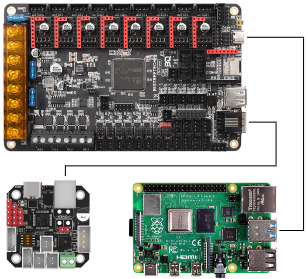

# Voron 2 Tall

<!-- <div align="center">
  
</div> -->

Collection of files for building custom Voron 2.4 with a build volume of 350 mm
x 350 mm x 930 mm (13.78 in x 13.78 in x 36.61 in) modified from the base LDO
Voron 2.4 Kit. 

## Mods
- [Cable Port Flush Mount Skirt](https://mods.vorondesign.com/details/3vEc5I965u0puzAmz9DqvA) - [ppak10](https://github.com/ppak10)
- [Enclosed Z-Chain Guide](https://mods.vorondesign.com/details/4mSRcdfNCvSq6nsRHETw) - [ppak10](https://github.com/ppak10)
- [Nevermore Micro](https://github.com/nevermore3d/Nevermore_Micro) - [nevermore3d](https://github.com/nevermore3d)
- [Purge Bucket](https://github.com/VoronDesign/VoronUsers/tree/main/orphaned_mods/edwardyeeks/Decontaminator_Purge_Bucket_%26_Nozzle_Scrubber) - [edwardyeeks](https://github.com/edwardyeeks)
- Umbilical Mount (Choose One) 
  - [Rear Umbilical](https://mods.vorondesign.com/details/ho9WEyf6msbGKhTbtM59mQ) - [Minsekt](https://github.com/Minsekt)
  - [PG7 Umbilical Mount](https://www.printables.com/model/312008-voron-24-a-drive-pg7-umbilical-mount) - [jphalip](https://www.printables.com/@jphalip)

- [Y Endstop Relocation](https://mods.vorondesign.com/details/ho9WEyf6msbGKhTbtM59mQ) - [Minsekt](https://github.com/Minsekt)

## Canbus Setup



I mostly followed the steps outlined in this [forum post](https://www.teamfdm.com/forums/topic/672-how-to-use-can-toolhead-boards-connected-directly-to-octopus-octopus-pro-on-canboot/?do=findComment&comment=9911) to connect EBB directly to
Octopus.

More specifically, I followed the guide this guide that was attached.

[**How to Use CAN Toolhead Boards Connected Directly to Octopus / Octopus Pro on CanBoot**](Manuals/Canbus/How%20to%20Use%20CAN%20Toolhead%20Boards%20Connected%20Directly%20to%20Octopus.pdf)

### Notes
1. CanBoot has updated name to Katapult but instructions in manual should still work.
2. If `can0` doesn't automatically show up in `ifconfig` so this command should solve that:
    ```bash
    sudo ip link set can0 up type can bitrate 250000
    sudo ip link set can0 txqueuelen 128
    ```
3. Make sure the high and low can wires are set correctly otherwise ebb will not show up properly.

### Troubleshooting 
- [CANBus_Query.py not returning EBB36’s UUID. Setup: Pi 4, Octopus v1.1, EBB36 v1.2](https://klipper.discourse.group/t/canbus-query-py-not-returning-ebb36s-uuid-setup-pi-4-octopus-v1-1-ebb36-v1-2/8464)
- [MCU timer too close error](https://klipper.discourse.group/t/help-with-troubleshooting-mcu-timer-too-close-error/15913/18)
- [EBB_CAN](https://github.com/EricZimmerman/VoronTools/blob/main/EBB_CAN.md)

## Toolhead (Dragon Burner 2.85 mm)
[Dragon Burner V8](https://github.com/chirpy2605/voron/tree/main/V0/Dragon_Burner)
toolhead is used as the base for mounting an
[Orbiter F2.85 mm](https://www.orbiterprojects.com/orbiter-f2-85/) extruder and
[V6 All-Metal HotEnd](https://e3d-online.com/products/v6-all-metal-hotend?variant=40923457519675).

### Notes
1. Some printed component will need some light sanding to fit together properly.
    - Be gentle with the fan components, they can break easily.
2. Make sure to calibrate E-steps as the default settings will most likely result in under-extrusion.
    - Here's a [good guide](https://ellis3dp.com/Print-Tuning-Guide/articles/extruder_calibration.html) with instructions to calibrate E-steps
    - General Formula: `new_rotation_distance = previous_rotation_distance * (actual_extrude_distance / 100)`

### Extruder


- [Orbiter F2.85 mm Files](https://www.thingiverse.com/thing:4860182)

### Hotend
- [How To: Successfully Assemble an E3D v6 All-Metal HotEnd](https://www.matterhackers.com/articles/how-to-assemble-an-e3d-v6-all-metal-hotend)

## Other Useful Links

### LDO Docs
- [Wiring Guide](https://docs.ldomotors.com/en/voron/voron2/wiring_guide_rev_c)
- [Printed Parts](https://docs.ldomotors.com/en/voron/voron2/printed_part_guide_rev_c)
